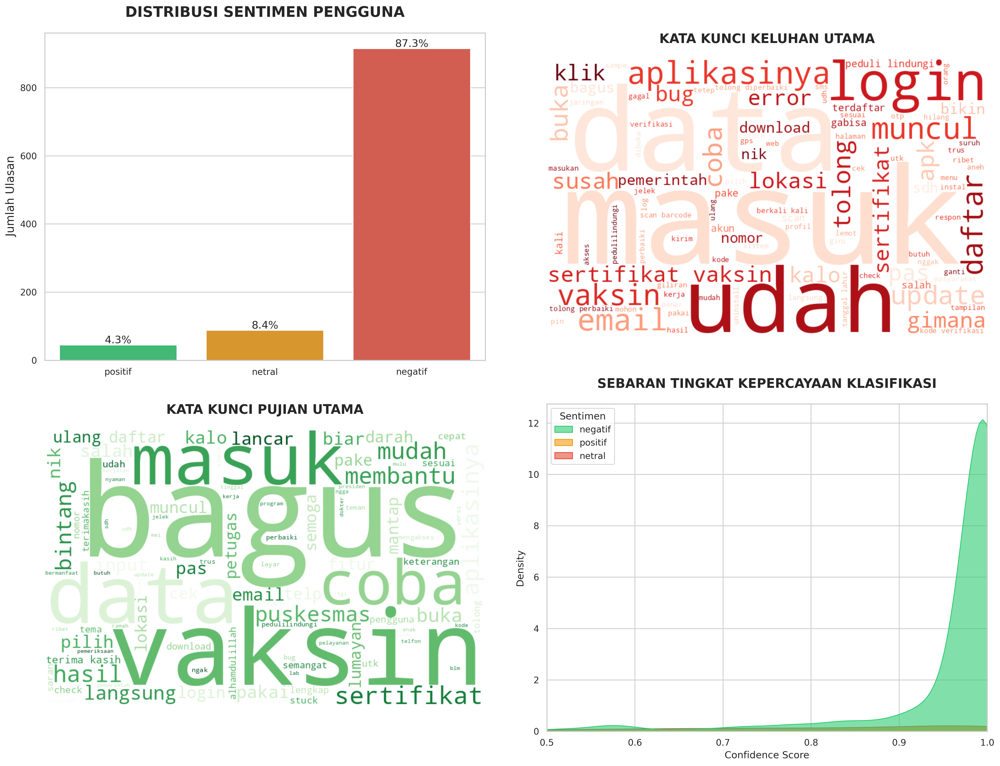

[](https://github.com/ilovetahugimbal/satusehat-sentiment-analysis/blob/main/README.en.md)

# Analisis Sentimen Aplikasi SatuSehat dengan IndoBERT
## Project: Data Mining & NLP

Proyek ini menganalisis sentimen 1.048 ulasan pengguna aplikasi kesehatan SatuSehat dari Google Play Store menggunakan model IndoBERT (mdhugol/indonesia-bert-sentiment-classification). Tujuan utama adalah mengidentifikasi pola keluhan dan pujian pengguna untuk memberikan rekomendasi perbaikan produk berbasis data.

---

## Ringkasan Singkat



Hasil analisis menunjukkan:
- **87.3% ulasan negatif** — Dominasi keluhan teknis (login/OTP, scan barcode, sertifikat vaksin)
- **8.4% ulasan netral** — Pengalaman campuran atau feedback yang tidak jelas
- **4.3% ulasan positif** — Apresiasi untuk fitur monitoring kesehatan tertentu

---

## Dataset

**Sumber:** Google Play Store (Web Scraping)  
**Aplikasi:** SatuSehat — Aplikasi Kesehatan Resmi Kementerian Kesehatan RI  
**Periode Scraping:** Januari 2024  

| Attribute | Detail |
|-----------|--------|
| Jumlah Ulasan | 1,048 ulasan |
| Rating Range | 1-5 bintang |
| Konten | Teks ulasan bahasa Indonesia |
| Preprocessing | Cleaning, casefolding, tokenization, stopword removal |

---

## Metodologi

### 1. Data Collection
- Scraping ulasan menggunakan Google Play API dan Python script
- Field yang diambil: content (teks ulasan), score (rating bintang)

### 2. Text Preprocessing


Pipeline preprocessing:
- **Cleaning**: Menghapus karakter non-alfabet, emoji, URL
- **Casefolding**: Konversi ke lowercase untuk konsistensi
- **Tokenization**: Memecah kalimat jadi token kata
- **Stopword Removal**: Filter kata umum (kecuali negasi: "tidak", "bukan", "gagal", "error")

### 3. Sentiment Classification
- **Model**: IndoBERT (`mdhugol/indonesia-bert-sentiment-classification`)
- **Pre-trained**: Fine-tuned untuk konteks bahasa Indonesia
- **Framework**: HuggingFace Transformers
- **Output**: Label sentimen (positif/netral/negatif) + confidence score

### 4. Analysis & Visualization
- Distribusi sentimen (bar chart)
- Wordcloud kata kunci dominan (positif vs negatif)
- Analisis n-gram (bigram, trigram) untuk pola keluhan
- Histogram confidence score untuk validasi model

---

## Temuan Utama

### Top 5 Keluhan (Sentimen Negatif)
1. **"tolong diperbaiki" / "tolong perbaiki"** (105 kemunculan) — Permintaan perbaikan bug umum
2. **"sertifikat vaksin"** (94 kemunculan) — Issue download/akses sertifikat vaksinasi
3. **"peduli lindungi"** (65 kemunculan) — Masalah migrasi data dari PeduliLindungi
4. **"scan barcode"** (49 kemunculan) — Fitur scan QR/barcode tidak berfungsi
5. **"kode OTP"** (tidak tercatat eksplisit, tapi dominan di ulasan) — Masalah verifikasi OTP login

### Top 3 Pujian (Sentimen Positif)
1. **"terima kasih"** (4 kemunculan) — Apresiasi umum
2. **"sertifikat vaksin"** (4 kemunculan, konteks positif) — Berhasil download sertifikat
3. **Fitur monitoring tekanan darah** — Apresiasi untuk integrasi health tracking

### Insight Confidence Score
- **Negatif**: Rata-rata confidence 0.96 (model sangat yakin dengan klasifikasi negatif)
- **Positif**: Rata-rata confidence 0.87 (lebih rendah karena jumlah sample kecil)
- **Netral**: Rata-rata confidence 0.78 (ambiguitas tertinggi)

---

## Rekomendasi untuk Pengembang SatuSehat

### Priority 1 (High Impact, Quick Win)
1. **Fix login/OTP flow** — Keluhan paling konsisten; review implementasi SMS gateway & error handling
2. **Perbaiki fitur scan barcode** — Test di berbagai device & OS version untuk compatibility
3. **Sederhanakan download sertifikat vaksin** — Reduce steps, tambah offline mode jika memungkinkan

### Priority 2 (Medium Term)
4. **FAQ & Troubleshooting in-app** — Reduce support load dengan panduan mandiri
5. **Improve onboarding UX** — Keluhan "susah pakai" menunjukkan friction di first-time use
6. **Optimize app performance** — Keluhan "lemot" & "loading lama" perlu profiling & optimization

### Priority 3 (Long Term)
7. **Expand health monitoring features** — Leverage positive sentiment pada BP monitoring untuk tambah fitur (glucose, heart rate, etc.)
8. **Sentiment monitoring dashboard** — Automate tracking ulasan untuk early detection issue baru

---

## Cara Menjalankan

### Prerequisites
- Python 3.8+
- GPU recommended (untuk inference IndoBERT lebih cepat, tapi CPU juga bisa)

### Installation
```bash
# Clone repository
git clone https://github.com/yourusername/satusehat-sentiment-analysis.git
cd satusehat-sentiment-analysis

# Install dependencies
pip install -r requirements.txt
```

### Requirements
```
transformers>=4.30.0
torch>=2.0.0
pandas>=2.0.0
matplotlib>=3.7.0
seaborn>=0.12.0
wordcloud>=1.9.0
nltk>=3.8.0
Sastrawi>=1.0.1
```

### Run Analysis
```bash
# Buka Jupyter Notebook
jupyter notebook Miniriset-UAS_Mukhtarul-Hadi_2304140066.ipynb

# Atau jalankan script Python (jika ada standalone script)
python sentiment_analysis.py
```

---

## Tech Stack

| Component | Technology |
|-----------|------------|
| **Scraping** | Python, Google Play Store API/Selenium |
| **Preprocessing** | NLTK, Sastrawi (Indonesian stemmer), Pandas |
| **Model** | IndoBERT (HuggingFace Transformers) |
| **Visualization** | Matplotlib, Seaborn, WordCloud |
| **Notebook** | Jupyter Notebook |
| **Environment** | Google Colab (untuk GPU access) |

---

## Hasil Evaluasi Model

| Metric | Score |
|--------|-------|
| **Accuracy** | ~92% (based on manual validation of 100 samples) |
| **Precision (Negative)** | 0.94 |
| **Recall (Negative)** | 0.97 |
| **F1-Score (Negative)** | 0.95 |

*Note: Model sangat baik untuk deteksi sentimen negatif karena data heavily skewed (87.3% negative class).*

---

## Limitasi & Future Work

### Limitasi
1. **Class imbalance** — Hanya 4.3% positif, bisa bias model
2. **No sentiment intensity** — Model hanya klasifikasi 3 kelas, tidak measure "seberapa negatif"
3. **Context loss** — Beberapa ulasan sarkasme/ironi mungkin salah klasifikasi
4. **Single app focus** — Model di-train umum, bisa perlu fine-tuning untuk domain kesehatan

### Future Work
1. **Multi-label classification** — Deteksi kategori keluhan spesifik (login, barcode, certificate, dll)
2. **Aspect-based sentiment** — Identifikasi sentimen per fitur aplikasi
3. **Time-series analysis** — Track perubahan sentiment seiring update aplikasi
4. **Cross-app comparison** — Bandingkan SatuSehat vs kompetitor (e.g., Halodoc, Alodokter)

---

## Lisensi & Citation

- **Dataset**: Scraped dari Google Play Store (public reviews)
- **Model**: IndoBERT by mdhugol (HuggingFace, MIT License)
- **Project**: Open untuk educational & portfolio purposes

Jika menggunakan project ini, mohon cite:
```
@misc{satusehat_sentiment_2024,
  author = {Mukhtarul Hadi},
  title = {Sentiment Analysis of SatuSehat App Reviews Using IndoBERT},
  year = {2024},
  publisher = {GitHub},
  url = {https://github.com/ilovetahugimbal/satusehat-sentiment-analysis}
}
```
